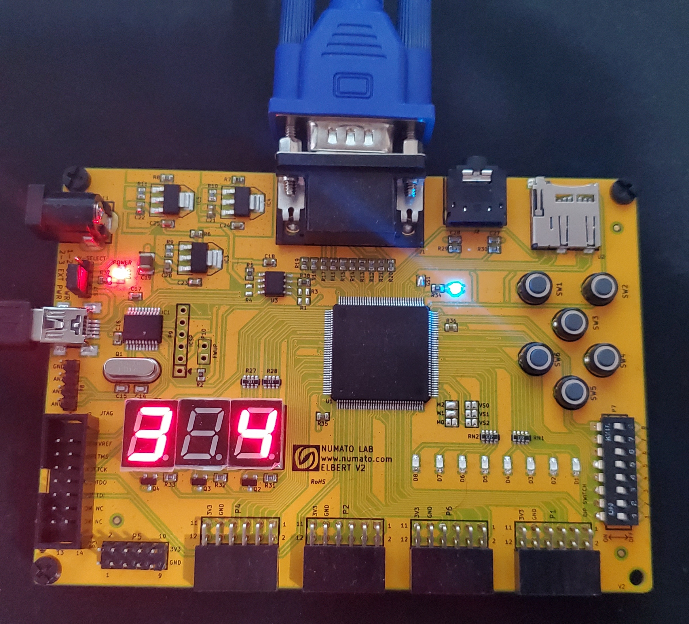

# FPGA Pong Game
Pong game implemented on a Elbert V2 FPGA development board using VGA.  
The game includes a start screen, and Pong logo on the top center alongside the scores of the two players  
Separate control for both paddles using the switches on the FPGA board.  
A start/stop button to start and stop the game.  
A round ball using a bitmap approach.  
A character tile approach to display text to the screen.  
The score is also displayed on the seven segment displays of the FPGA board.  
 
Below is a gif of the gameplay  
  
 
Below is an image of the FPGA board also showing the score of the two players on the multiplexed seven segment displays.  
  

